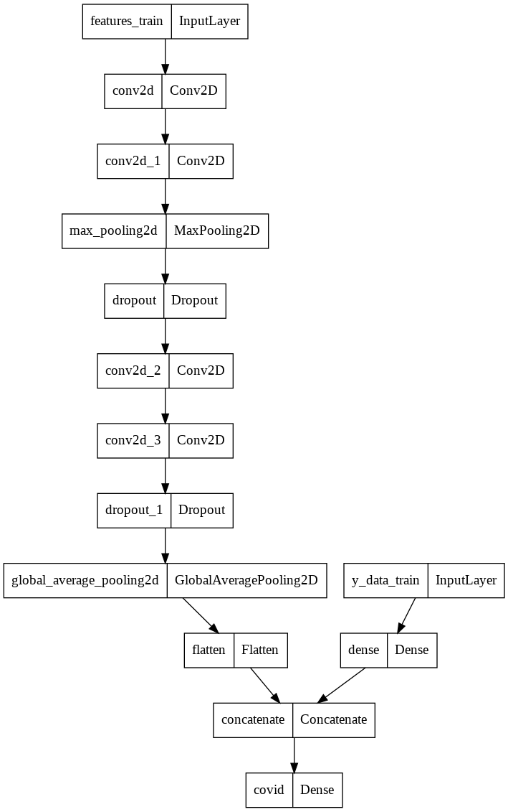
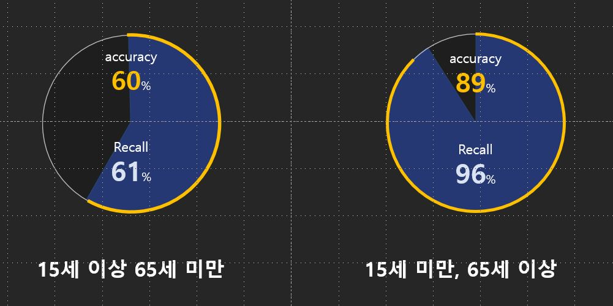

# [Multi Semi Project 2] 기침소리를 이용한 Covid-19 감염여부 판단 프로그램 구현 🦠

# 📌 프로젝트 소개
##  배경 

**기침소리를 이용한 Covid-19 감염여부 판단 프로그램 구현**

- 피험자의 기침소리 및 추가 데이터(ex : 성별, 호흡기 질환 여부, 발열 및 근육통 여부)를 이용해 Covid-19 양성&음성 판별 딥러닝 모델 구현을 목표로 함.

  

## 프로젝트 수행 과정

### 1. 데이터 전처리 및 탐색적 데이터 분석 

#### 1-1.음성 데이터 전처리 

1-1-1. 음성 데이터 중 무음 데이터와 기침 소리가 아닌 언어 데이터(사람 말소리) 제거

1-1-2. 음성 데이터의 진폭 정규화 수행

1-1-3. STFT 알고리즘을 적용 및 데이터 길이 정규화 수행

1-1-4. Mel Spectrogram 산출

1-1-5. MFCC 알고리즘을 적용하여 feature matrix를 산출

#### 1-2. csv 데이터 전처리 

1-2-1. 각 피험자의 추가적인 특성 데이터를 담고 있는 train dataset에서 필요없는 데이터 column(ex : 위경도 데이터)를 삭제

1-2-2. train dataset의 데이터 중 categorical data에 대한 labeling 진행

1-2-3. csv의 각 column과 covid-19(코로나 양성 여부)와의 대략적인 상관관계를 correlation matrix를 이용해 관찰

### 2. 모델 구현 및 평가

2-1. 청장년층(15~65세) 목소리 데이터와 그 외의 데이터로 분류 

2-2. 각각 데이터 그룹에 대해 기침 소리 feature matrix를 입력으로 받는 CNN 모델 구축 

2-3. train dataset을 입력으로 받는 DNN 모델 구축 

2-4. 위 2-1과 2-2에서 구현된 두 딥러닝 모델의 앙상블 모델 구현

2-5. test data에 대해서도 train data 전처리 과정과 동일한 과정을 거쳐 데이터 가공 후 가공된 데이터를 이용하여 모델 평가

### 3. 플라스크 구현 및 서비스 환경 구축 

flask를 이용해 사용자가 기침소리를 녹음해 양성/음성 여부를 판별하거나 이미 저장되어 있는 데이터셋의 결과를 확인해보는 기능을 구현 및 시연

## 프로젝트 수행 일정

​	05/30~06/08 : 주제 선정 및 탐색적 데이터 분석, 데이터 전처리

​	06/09~06/14 : 모델 구현 및 평가

​	06/15~06/16 : 발표 준비 및 발표

----
# 📌 팀 소개 
### [ 팀명 ] Rolling in the Deeplearning
### [ 구성원 및 역할 ]

**박영우** (팀장) 

​	- 팀장 및 최종발표, 모델링

**이충주** (팀원)

​	- 플라스크 구현, 모델링

**김성호** (팀원)

​	- 중간발표, 프로젝트 매니저, 모델링

**김현진** (팀원)

​	- 깃허브 관리자, 모델링

# 📌 프로젝트 결과

## 사용된 모델

## 모델의 score

